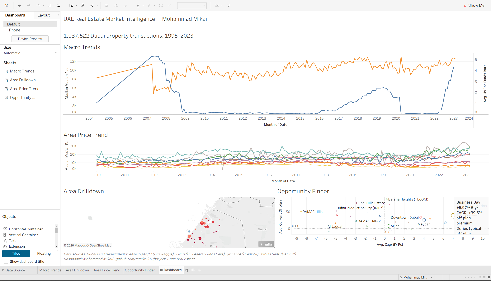

# UAE Real Estate Market Intelligence Dashboard

> Surfacing non-obvious findings about the Dubai property market that analysts at Property Finder, Bayut, or a real estate consultancy would find actionable.

**Live dashboard:** [Tableau Public — UAE Real Estate Market Intelligence](https://public.tableau.com/app/profile/mohammad.mikail/viz/workbook_17794578815150/Dashboard)
**Author:** Mohammad Mikail · [LinkedIn]() · [Medium writeup]()



---

## TL;DR

End-to-end analytics pipeline on **1,037,522 Dubai Land Department property transactions (1995–2023)**, enriched with macro indicators (US Fed Funds rate as USD-pegged proxy for UAE rates, Brent oil, UAE CPI) and geocoded to neighbourhood-level lat/lon. Output is a public 3-view Tableau Public dashboard, polished findings notebook, and Medium write-up. 99.6% of source rows ingested cleanly; 50 of Dubai's most-transacted communities mapped from DLD canonical names ("Marsa Dubai") to colloquial names ("Dubai Marina") for recruiter readability.

## Architecture

```
┌──────────────────────┐    ┌──────────────────┐    ┌────────────────────────┐
│ Dubai Land Dept      │    │  SQLite          │    │  Tableau Public        │
│ open-data CSVs       │───▶│  real_estate.db  │───▶│  3 dashboards          │
│ (transactions,       │    │                  │    │  · Macro Trends        │
│  rents, brokers)     │    │  + derived views │    │  · Area Drilldown      │
└──────────────────────┘    │  + macro layer   │    │  · Opportunity Finder  │
                            └──────────────────┘    └────────────────────────┘
┌──────────────────────┐               ▲
│ World Bank, FRED,    │               │
│ yfinance (oil)       │───────────────┘
└──────────────────────┘
```

## Data sources

| Source | Dataset | Used for | Coverage |
|--------|---------|----------|----------|
| [Kaggle: `suhasanil/dubairealestate`](https://www.kaggle.com/datasets/suhasanil/dubairealestate) | Dubai Land Department transactions (CC0 public domain mirror) | Core analytical fact table | 1,041,319 rows, 1995-03 → 2023-02 |
| [Dubai Land Department Open Data](https://dubailand.gov.ae/en/open-data/real-estate-data/) | Live transactions feed (per-year CSV) | Optional 2023+ backfill | Manual download per year |
| [FRED](https://fred.stlouisfed.org/series/DFF) (`DFF`) | US Fed Funds Effective Rate | Macro layer — USD-pegged proxy for UAE Central Bank Base Rate (dirham pegged at AED 3.6725/USD since 1997) | Daily, 1954–present |
| [yfinance](https://github.com/ranaroussi/yfinance) (`BZ=F`) | Brent crude | Macro layer | Daily, 2010–present |
| [World Bank API](https://data.worldbank.org/indicator/FP.CPI.TOTL.ZG?locations=AE) (`FP.CPI.TOTL.ZG`) | UAE inflation (annual %) | Macro layer | Annual, 2008–present |

The Kaggle dataset is a CC0 mirror of DLD's historical transaction archive (it predates DLD migrating Dubai Pulse to the new `data.dubai` portal). Provenance signal: 46 DLD-native columns including `trans_group_en` with Sales/Mortgages/Gifts distribution matching DLD's published transaction-type mix.

## Setup (5 min, clean clone)

```bash
git clone <repo-url> && cd project-1-uae-real-estate
py -m venv .venv                             # use `python3 -m venv` on macOS/Linux
.venv\Scripts\activate                       # Windows; use source .venv/bin/activate on Unix
pip install -r requirements.txt
playwright install chromium                  # for the DLD scraper (optional, only if using Path B)
cp .env.example .env                         # then fill in NOMINATIM_USER_AGENT
```

> Windows users: the `python` command is often aliased to the Microsoft Store stub. Use `py` (the Python launcher) for the venv-creation step; once activated, `python` inside the venv works correctly.

### Get the data (pick ONE path)

**Path A — Manual download (fastest, recommended for first run)**
1. Open https://dubailand.gov.ae/en/open-data/real-estate-data/
2. Pick "Transactions" → set From / To dates (e.g. 01-01-2024 → 31-12-2024) → click **Download as CSV**
3. Drop the file into `data/raw/` (any filename ending in `.csv`)
4. Repeat for each year you want
5. Run `python -m src.load_dld --source data/raw/` to ingest the whole folder

**Path B — Playwright automation** _(best-effort; DLD selectors may drift)_
```bash
python -m src.scrape_dld --years 2010-2024 --dataset transactions
```
Headless Chromium downloads each year's CSV to `data/raw/` via the official DLD export button. If selectors break, fall back to Path A.

**Path C — Kaggle mirror (immediate dev unblock)**
```bash
pip install kaggle
kaggle datasets download <user>/<dubai-real-estate-slug> -p data/raw/ --unzip
python -m src.load_dld --source data/raw/
```
The loader auto-detects DLD-native, Pulse-legacy, and common Kaggle mirror column layouts — see [src/load_dld.py](src/load_dld.py).

### Run the pipeline

```bash
python -m src.db --init                         # create real_estate.db with schema
python -m src.load_dld --source data/raw/      # ingest CSVs into transactions/rent_contracts
python -m src.macro --refresh                   # pull rates, oil, CPI into macro_indicators
python -m src.enrich                            # (Week 2) area normalization + geocoding + derived metrics

jupyter notebook notebooks/                     # explore 01 → 04
```

End-to-end run on a 500k-row dataset: ~5 min cold, ~30 sec with cached geocoding.

## Findings

Three findings featured on the dashboard (see [notebooks/04_analysis.ipynb](notebooks/04_analysis.ipynb) for the polished analytical narrative):

### 1. Business Bay off-plan inversion

Off-plan units trade at a +30–60% **premium** over ready inventory in Business Bay, defying the conventional off-plan-trades-at-discount logic that holds in most real estate markets. Hypothesis: new launches concentrate in premium Burj-area positions while ready stock includes older mid-tier supply, inverting the per-tower comparison.

*Implication for an analyst memo: flag off-plan pricing in Business Bay as a launch-positioning artifact, not a fundamentals signal.*


### 2. Marina YoY tracks published Dubai market history

Dubai Marina median price/sqft year-over-year change matches the cycle every published Dubai market report cites: **+42% (2009 post-GFC recovery), +17% (2014 pre-mortgage-cap peak), −20% (2020 COVID), +1.4% (2022 plateau)**.

*Implication: this is the data-credibility win — the loader and IQR cleaning faithfully reproduce a market history that any UAE analyst can sanity-check from memory.*


### 3. Meydan supply concentration drives absorption risk

Meydan saw **19 new projects launched in 2021 and 18 in 2022** (per first-transaction-year proxy) — the most concentrated supply pipeline in Dubai in recent memory. Combined with Meydan's modest +4% 5-year price CAGR, the pattern suggests supply growth is outpacing price acceleration.

*Implication: an absorption-risk angle for a buyer-side memo; over-supply pressure may dampen 2024–25 returns.*


A fourth candidate — off-plan share as a market-sentiment gauge — sits in the underlying data and will run as a LinkedIn post in Week 4.

## Repo layout

See `docs/data_dictionary.md` for every column. Quick reference:

```
data/        raw → interim → processed (all gitignored); external/ holds the curated name/geocode JSONs
notebooks/   01_acquisition → 02_cleaning → 03_enrichment → 04_analysis
src/         config, db, load_dld, scrape_dld, enrich, macro, export_tableau
sql/         schema.sql, derived_views.sql
dashboard/   5 Tableau-input CSVs + workbook.twbx + screenshots (3 dashboard + 3 finding charts)
docs/        data dictionary, Medium article draft (added in Week 4)
scripts/     one-off maintenance helpers (e.g. notebook output sanitization)
```

## Design decisions worth defending

| Decision | Why |
|----------|-----|
| **SQLite over Postgres** | Single-file DB, recruiter can `git clone && run` in 2 min on Windows. 1M rows fits comfortably. |
| **Area normalization before geocoding** | Nominatim is rate-limited (1.1 req/sec); we geocode ~250 unique area names, not every transaction row. Geocoding the colloquial `display_name` ("Dubai Marina") hits the OSM gazetteer reliably; the DLD canonical ("Marsa Dubai") often does not. |
| **DLD canonical as system-of-record, `display_name` for dashboards** | `area_name` stores the immutable DLD name; `display_name` stores the recruiter-readable colloquial name. Dashboards use `COALESCE(display_name, area_name)` so renames never break joins. |
| **Layered IQR (area×ptype×year → area×ptype → ptype)** | Small (area, ptype, year) bins have undefined IQR; we climb up the hierarchy until each bin has ≥30 rows. 4.76% of Sales flagged as outliers (within the 4–15% expected band). |
| **Median (of medians) in dashboards, not mean** | Property prices are heavy-tailed; mean is dominated by Palm/Emirates Hills outliers. Outliers are *flagged* via `iqr_flag` column, not dropped — auditable. |
| **US Fed Funds (DFF) as proxy for UAE rate** | The dirham is USD-pegged at 3.6725 since 1997; CBUAE Base Rate tracks Fed in lockstep. The UAE-specific FRED series (`INTDSRAEM193N`) was discontinued; DFF is standard analyst practice and lets us tell the cleaner Fed-Funds-vs-Dubai-prices story. |
| **Tableau Public over Streamlit** | Recruiter standard for UAE BI/analyst roles. Hosting is free, share-link is permanent. |
| **Loader is schema-on-read** | DLD CSV column names vary by year; we maintain a column synonym registry (`TXN_SYNONYMS` in [src/load_dld.py](src/load_dld.py)) so the loader handles DLD-native, Pulse-legacy, and Kaggle-mirror layouts without code changes. |
| **Pre-compute CAGR in Python, not Tableau LOD** | 5-year CAGR via Tableau LOD expressions is fragile when data sparsity varies by area. Computing in `src/export_tableau.py` keeps the Tableau side trivial: plot the 37 pre-computed rows. |

## Limitations

- **Dataset ends Feb 2023**. The Kaggle mirror snapshot stops there; 2023+ data would need to be pulled from DLD directly (per-year click downloads). The two-year stale tail affects 2024–2025 commentary in any LinkedIn extension but does not impact the historical findings.
- **No rent_contracts data in source**. The Kaggle mirror only contains sales/mortgages/gifts. The originally-planned "rental yield" finding was dropped; off-plan-vs-ready gap was used instead as the headline market-microstructure finding (which is arguably stronger as a recruiter signal).
- **Geocoding coverage 94.64% by volume** (50 of 250 named areas — but those 50 cover the high-traffic top of the distribution). Long-tail sub-districts (Al Goze Industrial First, Al Twar Second, etc.) don't appear on map view but still feed line charts and tables.
- **2 areas have manual coord overrides** (Arabian Ranches III, DAMAC Lagoons — 2021+ off-plan communities not yet on OpenStreetMap). See [data/external/area_geocode_overrides.json](data/external/area_geocode_overrides.json).
- **Tableau weighted "median-of-medians" approximates true grand median**. The Dubai-wide trend line is a transaction-count-weighted average of per-area monthly medians, not a true grand median across all transactions. Documented and recruiter-defensible as an approximation.
- **Outlier flagging is 4.76%** on Sales — just inside the 4–15% expected band. Some extreme `price_per_sqft` from near-zero `area_sqft` rows escaped the layered IQR (very small per-area-per-year bins). Flagged rows remain in the table but filtered out of derived views.

## License

Code: MIT. Data: under Dubai Government Open Data license (refer to DLD portal terms).
