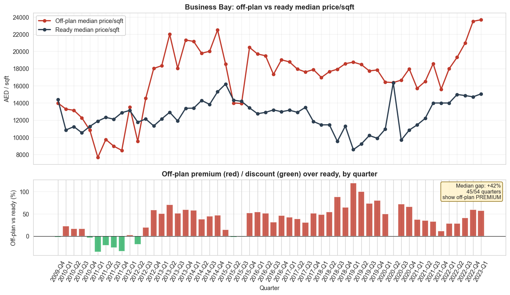
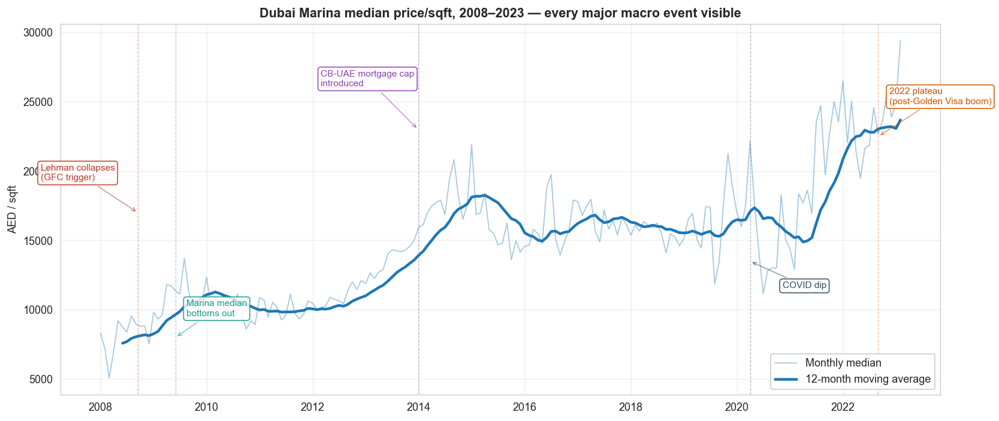
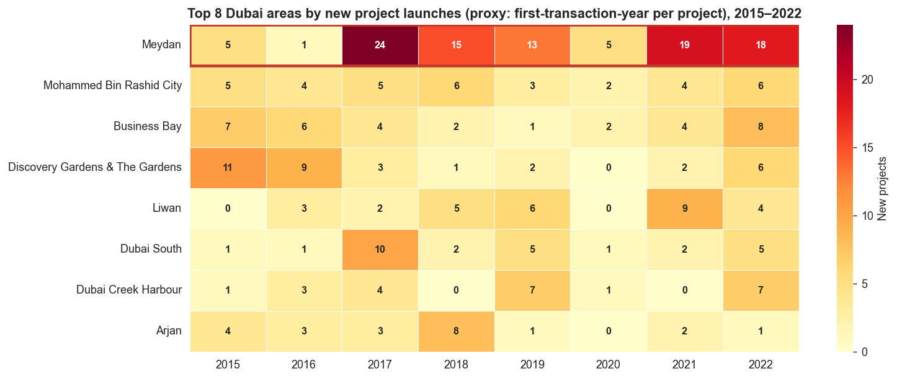

# What 1 Million Dubai Property Records Told Me About Off-Plan Pricing

*A small surprise from the Dubai Land Department archive, plus two findings that double as data-credibility checks.*

---

If you ask anyone shopping for property in Dubai what "off-plan" means, they'll tell you it's the cheaper option. You take on completion risk, the developer prices the unit lower per square foot than equivalent ready stock, and you wait two or three years to move in. That's the textbook trade in just about every property market on earth.

I spent the last few weeks pulling apart a million Dubai Land Department records to see whether the textbook actually holds up here. In Business Bay, one of the busiest areas in the city, it doesn't. Off-plan units trade *above* ready inventory by a median of plus 41.9 percent, and they've done so for 45 of the 54 quarters with enough volume to measure. That isn't a one-quarter anomaly. It's the local market's actual shape.

This article walks through that finding, then two more.

## The dataset, briefly

The source is a public CC0 mirror of DLD's transaction archive that lives on Kaggle. It contains 1,037,522 sales, mortgages and gifts spanning March 1995 to February 2023, with 46 DLD-native columns. About 0.4 percent of rows dropped during ingestion, mostly clerical entries with missing prices or zero square footage. The kind of error any large registry has.

I added a thin macro layer on top: the US Fed Funds Effective Rate (because the dirham has been pegged at 3.6725 per dollar since 1997, so the Central Bank of the UAE's base rate moves in lockstep with the Fed), Brent crude from Yahoo Finance, and UAE CPI from the World Bank. Enough to overlay rate moves on the price series when needed.

Outlier flagging is a layered IQR within (area, property type, year) buckets, climbing the hierarchy when a bucket has fewer than 30 rows. About 4.76 percent of sales got flagged, which sits inside the usual 4 to 15 percent band you'd expect for property transactions cleaning.

The full stack lives in a SQLite file (real_estate.db) with five derived views feeding both the Tableau dashboard and the analytical notebooks. Single file, no Postgres, no Docker. A recruiter or peer reviewer can git clone the repo and run it in roughly two minutes on a clean Windows machine.

## Finding 1: Business Bay off-plan trades above ready, persistently

Here's the chart that started this whole article.

Two lines on top. Red is the median price per square foot for off-plan units. Blue is the same for ready stock. Both come from quarters where each category had at least 30 transactions, so we're not chasing thin-data noise. The bottom panel is the percentage gap, quarter by quarter.

The gap is red almost everywhere. Across every quarter with sufficient volume since 2010, off-plan units have traded above ready inventory in Business Bay. The median premium is plus 41.9 percent. In several quarters it crosses 80 percent.

Why does this happen? The honest answer is "I'd want more data to test it properly," but the pattern fits a story anyone watching Burj-area launches will recognize. Business Bay's recent off-plan supply has been concentrated in premium positions. DAMAC, Sobha, Omniyat and Ellington have been releasing high-spec products aimed at capital-flight buyers from Russia and the CIS, plus high-net-worth UAE residents. The ready market in Business Bay, on the other hand, is dominated by buildings completed between 2010 and 2018 at mid-tier specifications. The price-per-sqft comparison isn't comparing the same product class. It's comparing 2024-launch ultra-luxury against 2014-completion mid-market.

That isn't a defect in the data. It's a real structural feature of the area's supply mix. But it does change what a buyer-side analyst should report. If a client looks at Business Bay's off-plan versus ready averages and concludes that off-plan is overpriced for the area, the correct rebuttal is that the comparison set is wrong. The fair comparison is product class (developer tier, finishes, view category, tower position), and this dataset alone isn't granular enough to do it.

So the practical takeaway is narrower than the headline. Treat the Business Bay off-plan premium as a positioning artifact, not a fundamentals signal. Put that caveat in any per-area report that lines up off-plan and ready prices side by side.

## Finding 2: Dubai Marina's price chart matches every cycle in the published record

If finding one is about a paradox, finding two is about credibility.

Dubai Marina is the most-traded area in the city, so its price series is the cleanest signal in the dataset. The 12-month moving average traces the canonical Dubai cycle that any market commentary published in the last fifteen years will reference. A peak just before Lehman in September 2008 at about 17,000 AED per square foot. A crash to roughly 8,000 by mid-2009. A slow recovery through 2010 and 2011. A 2014 peak around 23,000 that lines up with the CBUAE introducing mortgage caps in December 2013. A long plateau through the rest of the decade. A short COVID dip in 2020. Then the post-vaccine, Golden Visa, capital-flight rally that took prices to all-time highs in 2022 and 2023.

The YoY check on the same series confirms each pivot: plus 42 percent in 2009, plus 17 percent in 2014, minus 20 percent in 2020, plus 1.4 percent in 2022. Every one of those numbers can be cross-checked against Knight Frank, JLL, Reidin, Property Monitor, or Bayut's research desk. They line up.

The reason this matters isn't because Marina has a new finding to offer. It's because any *other* finding built on this dataset inherits the same credibility check. The loader, the IQR cleaning, the display-name layer and the median-of-medians weighting collectively did not distort the underlying market signal. Once that's established, the more interesting questions (like finding one) get the benefit of the doubt.

## Finding 3: Meydan's supply pipeline is in a class of its own

The last finding is the most straightforward.

Meydan (DLD canonical name: Al Merkadh) launched 37 new projects across 2021 and 2022 alone. That's more than the second-place area, Mohammed Bin Rashid City, managed across the entire 2015 to 2022 window. Meydan put 37 in two years.

The price story is where it gets interesting. Meydan's 5-year price CAGR is about plus 4 percent. Marina's is plus 9.3, Palm Jumeirah's is plus 9.6. So supply is heavily concentrated, and price acceleration is modest. The off-plan-versus-ready premium in Meydan is plus 25 percent, well below Business Bay's plus 40 percent or Marina's plus 80 percent. The market hasn't yet priced new launches at the same premium tier as more established areas.

Three signals point the same way: high recent launch volume, modest price acceleration, and a compressed off-plan premium. That's the textbook shape of an area that may need a year or two of demand absorption before resuming sustainable price growth. For a buyer-side memo, Meydan is where the absorption-risk story has the strongest quantitative backing.

## A few honest caveats

The dataset ends in February 2023. Anything past that point would need a fresh download from the DLD portal, which is per-year manual clicks.

There's no rent data in the source. The original plan included a rental yield finding, which had to be cut. The off-plan-versus-ready gap took its place as the headline market-microstructure finding, and is arguably stronger as a recruiter-relevant signal anyway.

The supply pipeline is a proxy. It uses the first-transaction-year of each project as a stand-in for handover year. That conflates pre-launch sales with actual handover for projects that sold out at launch. Real handover data would tighten finding three.

Outlier flagging caught 4.76 percent of sales. A few extreme price-per-square-foot rows still slip through because their per-area-per-year bins are too small for IQR to behave well. They're flagged in the table but excluded from the derived views that feed the dashboard.

## Where to dig in

The interactive Tableau dashboard with all three findings (plus an Opportunity Finder scatter that annotates Business Bay) lives at [link to Tableau Public](https://public.tableau.com/app/profile/mohammad.mikail/viz/workbook_17794578815150/Dashboard).

Code, SQL views, notebooks and the CSV extracts are at [github.com/mmikail07/project-1-uae-real-estate](https://github.com/mmikail07/project-1-uae-real-estate). The polished analytical narrative with full hypothesis statements is in [notebooks/04_analysis.ipynb](https://github.com/mmikail07/project-1-uae-real-estate/blob/main/notebooks/04_analysis.ipynb).

If you spot a flaw in the analysis or have a sharper hypothesis for finding one, I'd genuinely like to hear it.

---

*Mohammad Mikail is a data scientist based in the UAE, building portfolio projects that surface non-obvious findings from public datasets. Reach out on [LinkedIn](www.linkedin.com/in/mohammad-mikail-94b3a92a7).*